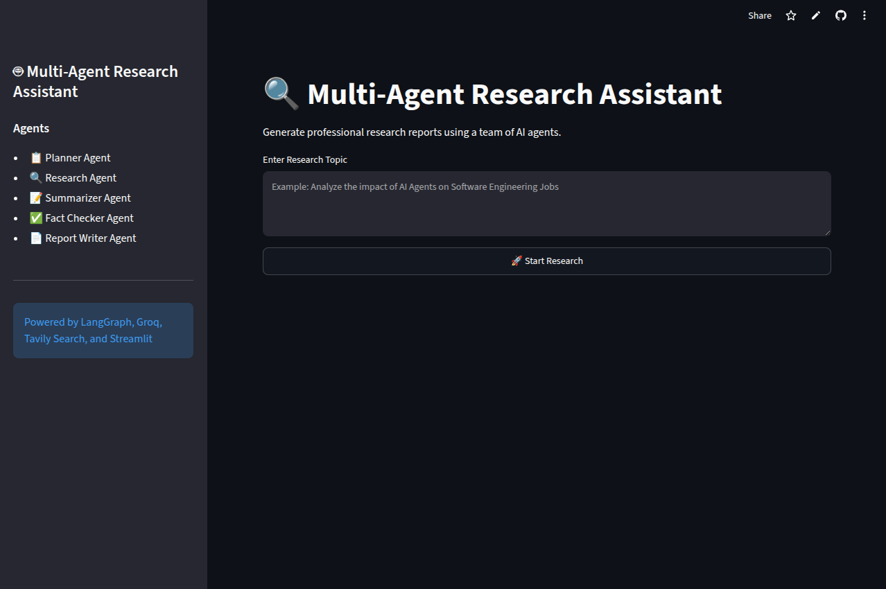
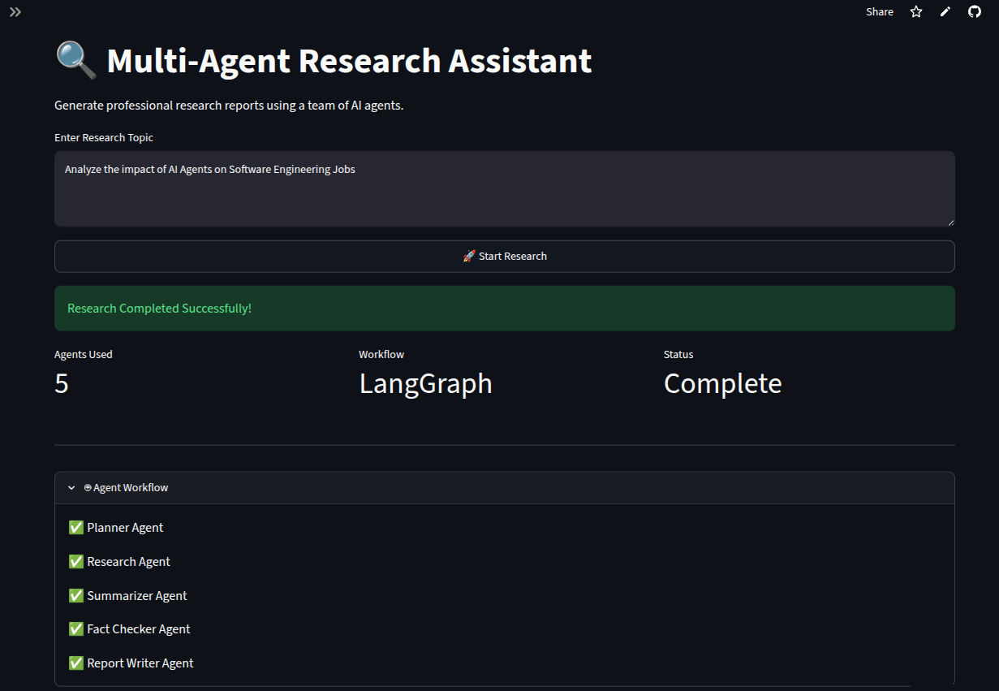
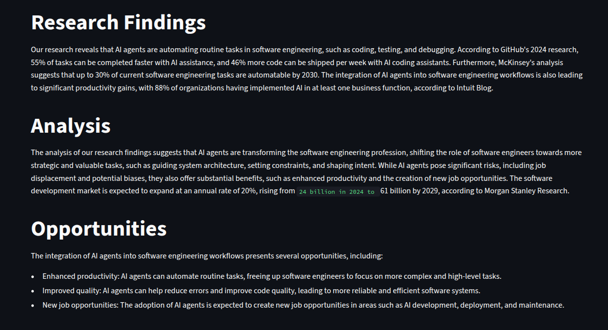

# Multi-Agent Research Assistant

A **Multi-Agent Research Assistant** built with **LangGraph**, **LangChain**, and **Streamlit** that automates the research workflow using multiple specialized AI agents.  
The system takes a user query, plans the research process, gathers information, summarizes findings, fact-checks content, and generates a final structured research response.

---

## Overview

This project demonstrates an **Agentic AI workflow** where multiple AI agents collaborate to solve a research task.  
Instead of relying on a single LLM response, the system divides the task into multiple stages such as planning, researching, summarizing, fact-checking, and writing.

Each agent has a dedicated responsibility, making the system more modular, scalable, and interpretable while simulating a real-world research pipeline.

---

## Features

- Multi-agent research workflow
- Query planning and task breakdown
- Information gathering and summarization
- Fact-checking of generated content
- Final structured research/report generation
- Modular agent-based architecture
- Interactive Streamlit interface

---

## Agent Architecture

The project consists of the following specialized agents:

### 1. Planner Agent
Breaks the user query into a structured research plan and defines how the task should be approached.

### 2. Researcher Agent
Collects relevant information and explores the topic based on the plan.

### 3. Summarizer Agent
Condenses the collected information into concise and meaningful summaries.

### 4. Fact Checker Agent
Validates and reviews the summarized content to improve reliability and consistency.

### 5. Writer Agent
Generates the final polished response/report using the validated research findings.

---

## Workflow

```text
User Query
   │
   ▼
Planner Agent
   │
   ▼
Researcher Agent
   │
   ▼
Summarizer Agent
   │
   ▼
Fact Checker Agent
   │
   ▼
Writer Agent
   │
   ▼
Final Research Output
```

---

## Project Structure

```text
multi-agent-research-assistant/
│
├── agents/
│   ├── fact_checker.py
│   ├── planner.py
│   ├── researcher.py
│   ├── summarizer.py
│   └── writer.py
│
├── graph/
│   ├── state.py
│   └── workflow.py
│
├── screenshots/
│   ├── homepage.png
│   ├── workflow.png
│   ├── research_intro.png
│   └── research_report.png
│
├── app.py
├── llm.py
├── requirements.txt
└── README.md
```

---

## Tech Stack

| Category | Technology |
|----------|------------|
| Programming Language | Python |
| Agent Framework | LangGraph |
| LLM Framework | LangChain |
| User Interface | Streamlit |
| AI Models | Large Language Models (LLMs) |

---

## How It Works

1. The user enters a research query in the Streamlit app.
2. The **Planner Agent** creates a structured research plan.
3. The **Researcher Agent** gathers information relevant to the topic.
4. The **Summarizer Agent** condenses the findings into concise summaries.
5. The **Fact Checker Agent** reviews and validates the summarized content.
6. The **Writer Agent** generates the final research response/report.

This multi-step pipeline produces more organized and interpretable outputs compared to a single-step LLM workflow.

---

## Screenshots

### Homepage
Shows the main interface of the Multi-Agent Research Assistant where the user enters a research query and starts the workflow.



### Workflow
Displays the multi-agent workflow/architecture, showing how different agents collaborate to process the research task.



### Research Introduction
An example of the initial research output generated by the system after processing the query.


### Research Report
Shows the final structured report produced by the assistant after planning, researching, summarizing, fact-checking, and writing.



---

## Installation

Clone the repository:

```bash
git clone https://github.com/Sarfraz-Ali-007/multi-agent-research-assistant.git
cd multi-agent-research-assistant
```

Install dependencies:

```bash
pip install -r requirements.txt
```

---

## Run the Application

Start the Streamlit app:

```bash
streamlit run app.py
```

---

## Example Use Cases

- Topic research and summarization
- Academic concept exploration
- Technical research assistance
- Structured content generation
- Multi-step AI reasoning workflows

---

## Skills Demonstrated

- Agentic AI
- Multi-Agent Systems
- LangGraph
- LangChain
- LLM Application Development
- Prompt Engineering
- Workflow Orchestration
- Streamlit App Development
- Python

---

## Future Improvements

- Add web search integration for live research
- Store conversation/research memory
- Export final reports to PDF or DOCX
- Add citations and source tracking
- Support multiple LLM providers
- Improve fact-checking with retrieval tools

---

## Author

**Sarfraz Ali**  
GitHub: https://github.com/Sarfraz-Ali-007

---

## License

This project is for learning and portfolio purposes.
